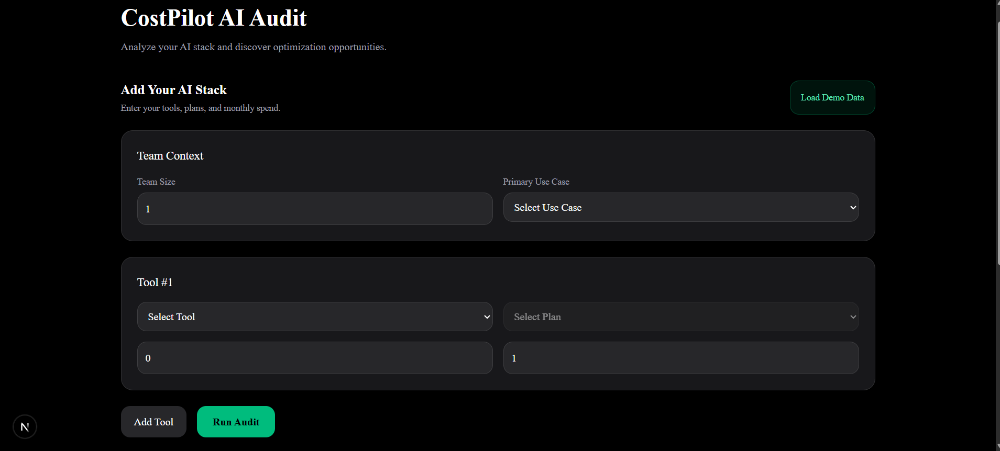
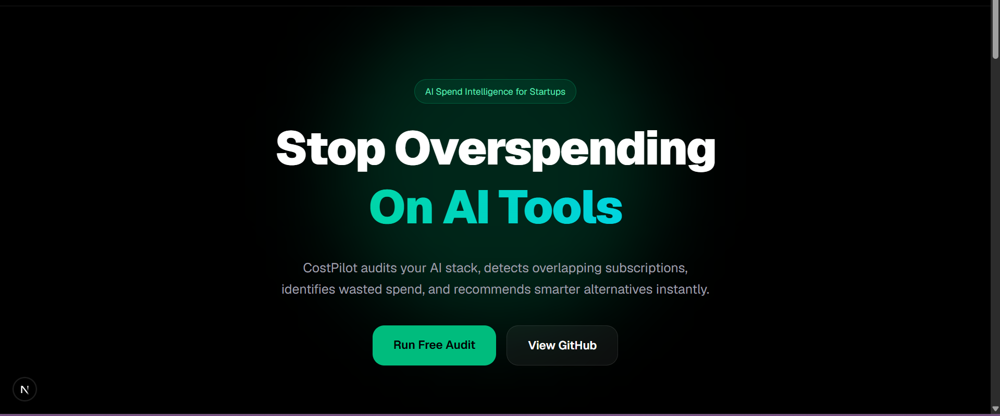
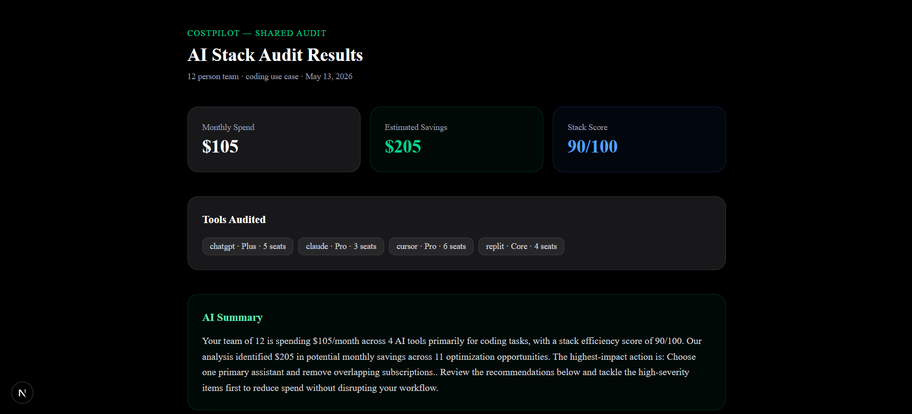

# CostPilot

CostPilot is an AI-powered audit tool that analyzes your team's AI software stack, identifies redundant tools and billing inefficiencies, and generates a personalized savings report in under 10 seconds. It's built for team leads, engineering managers, and operators who are spending on multiple AI subscriptions but aren't sure if they're getting value from all of them.

---

## Screenshots

> **Form — Enter your AI stack**
> 

> **Landing Page**
> 

> **Shareable URL — Public audit page**
> 

---

## Screen Recording

▶️ [Watch the 30-second walkthrough on YouTube](https://youtu.be/ChciDz1DP1g)

---

## Live Demo

🚀 [cost-pilot-1i6k.vercel.app](https://cost-pilot-1i6k.vercel.app)

---

## Quick Start

### Prerequisites

- Node.js 18+
- A [Supabase](https://supabase.com) project
- An [Anthropic](https://console.anthropic.com) API key

### 1. Clone and install

```bash
git clone https://github.com/YOUR_USERNAME/costpilot.git
cd costpilot
npm install
```

### 2. Set up environment variables

Create a `.env.local` file in the project root:

```env
ANTHROPIC_API_KEY=sk-ant-...
NEXT_PUBLIC_SUPABASE_URL=https://your-project.supabase.co
NEXT_PUBLIC_SUPABASE_ANON_KEY=eyJ...
```

### 3. Set up the database

In your Supabase project, go to **SQL Editor** and run:

```sql
create table audits (
  id uuid primary key default gen_random_uuid(),
  created_at timestamptz default now(),
  tools jsonb not null,
  team_size int not null,
  primary_use_case text not null,
  total_monthly_spend numeric not null,
  estimated_savings numeric not null,
  stack_score int not null,
  recommendations jsonb not null,
  summary text not null
);
```

### 4. Run locally

```bash
npm run dev
```

Open [http://localhost:3000](http://localhost:3000).

### 5. Deploy to Vercel

[](https://vercel.com/new)

1. Push your repo to GitHub
2. Import it on [vercel.com](https://vercel.com)
3. Add the three environment variables from step 2 in the Vercel dashboard
4. Click Deploy — Vercel auto-detects Next.js, no config needed

---

## Architecture

```
app/
├── audit/
│   ├── page.tsx          # Main audit form + results page
│   └── [id]/page.tsx     # Public shareable audit page (SSR + OG tags)
├── api/
│   └── audit/
│       └── summary/
│           └── route.ts  # Server-side Anthropic API route
components/
├── forms/
│   └── AuditForm.tsx     # Form with localStorage persistence
├── results/
│   ├── StatsCard.tsx
│   ├── RecommendationCard.tsx
│   └── EmptyState.tsx
lib/
├── supabase.ts           # Supabase client
└── audit/
    ├── runAudit.ts       # Audit math (hardcoded rules)
    ├── recommendations.ts # Recommendation engine
    ├── generateSummary.ts # Anthropic API call + fallback
    └── saveAudit.ts      # Persists audit to Supabase
types/
└── audit.ts              # Shared TypeScript interfaces
```

---

## Decisions

### 1. Hardcoded rules for audit math, AI only for the summary
The recommendations and savings estimates use deterministic rule-based logic rather than AI. Financial advice needs to be consistent, auditable, and reproducible — a model could hallucinate savings numbers or contradict itself between runs. AI is used only where it adds clear value: synthesizing a personalized natural-language summary from structured data that would otherwise read like a template.

### 2. Supabase over a custom Postgres instance
Supabase gave us a hosted Postgres database, a REST API, and a JS client in under 10 minutes with zero ops overhead. A self-hosted Postgres on Render would have required setting up connection pooling, migrations, and backups manually. For a project at this stage, Supabase's free tier covers all storage needs and keeps the focus on product, not infrastructure. It also sets up the schema for lead capture (feature 5) without any additional setup.

### 3. Server-side API route for the Anthropic key
The Anthropic API key is called from `app/api/audit/summary/route.ts` rather than directly from the client. This keeps the key out of the browser bundle entirely. A client-side fetch to the Anthropic API would expose the key in network requests, allowing anyone to extract and abuse it. The extra round-trip adds ~50ms but is non-negotiable for key security.

### 4. localStorage for form persistence instead of a database
Form state (tool entries, team size, use case) is persisted to `localStorage` on every change and rehydrated on mount. This was chosen over saving a draft to Supabase because it requires no auth, no user identity, and no additional API calls. The trade-off is that drafts don't sync across devices, but for a single-session audit tool this is an acceptable limitation. A `useEffect` two-step pattern (hydrate on mount, persist on change) avoids SSR hydration mismatches in Next.js.

### 5. Shareable URL shows tools and numbers but strips identity
The public `/audit/[id]` page displays tool names, plan names, seat counts, spend, and recommendations — but never the submitter's email, company name, or any PII (these aren't collected yet, but the architecture anticipates feature 5). The page is statically rendered per request (Next.js SSR) so OG meta tags are populated server-side, meaning link previews work correctly on Twitter, Slack, and LinkedIn without any client-side rendering tricks.

---

## Prompts

See [PROMPTS.md](./PROMPTS.md) for the full AI summary prompt, design, variable documentation, and fallback behavior.

---

## Tech Stack

| Layer | Choice |
|---|---|
| Framework | Next.js 15 (App Router) |
| Language | TypeScript |
| Styling | Tailwind CSS |
| Database | Supabase (Postgres) |
| AI | Anthropic Claude (`claude-sonnet-4-20250514`) |
| Deployment | Vercel |